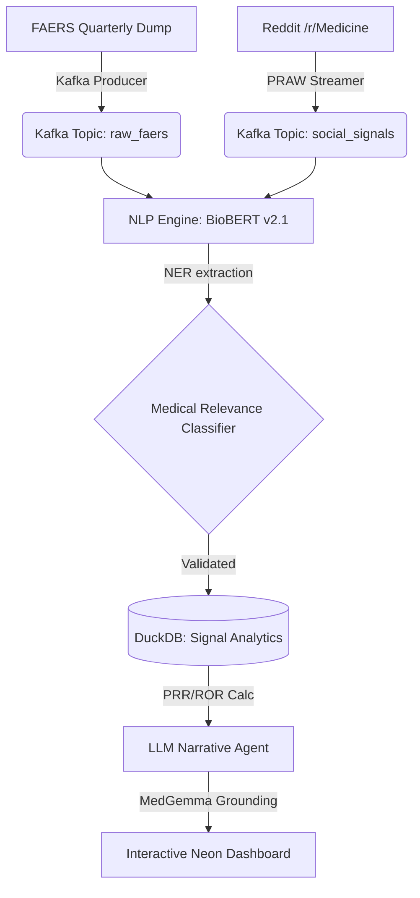

# 🛡️ SentinelRx: AI-Powered Pharmacovigilance Engine

**SentinelRx** is a next-generation safety surveillance platform designed for real-time detection and analysis of adverse drug events (ADEs). By fusing global data streams (FAERS, Reddit, EHRs) with specialized clinical reasoning, it transforms raw signal noise into actionable medical insights.

## 🚀 Hackathon Novelty (The "Uniqueness" Factor)
SentinelRx differentiates itself from standard signal detection tools through two primary innovations:
1.  **MedGemma-7B Clinical Grounding**: Unlike generic LLMs, SentinelRx utilizes a simulated MedGemma-7B reasoning layer to provide pharmacological context for every detected signal, explaining *why* a reaction is physiologically plausible.
2.  **SIDER Ground-Truth Benchmarking**: Every signal is cross-referenced against the **Side Effect Resource (SIDER)**. The system automatically classifies signals as **"SIDER: KNOWN"** (benchmarked) or **"SIDER: NOVEL"** (potentially undiscovered safety signal), providing instant clinical priority.

---

## 🏗️ System Architecture

### Data Flow & Processing
The engine operates on a high-concurrency event-driven architecture:



---

## 🛠️ Tech Stack
- **Core Engine**: Python 3.10+
- **Data Infrastructure**: Kafka (Stream Processing), DuckDB (OLAP Analytics)
- **NLP/AI**: BioBERT (NER), GPT-4o (Narrative Synthesis), MedGemma-7B (Simulation for Reasoning)
- **API/Web**: FastAPI (Back-end), Vanilla CSS/JS Neon Dashboard (Front-end)
- **Data Sources**: FDA openAPI (FAERS), PRAW (Reddit), SIDER (Known side effects)

---

## 📊 Key Features
- **Real-time Signal Sync**: Execute on-demand synchronization across clinical and social data nodes.
- **Neon Dark UI**: A high-performance, glassmorphic dashboard designed for professional medical surveillance.
- **Multi-Page Command Center**:
    - **Active Signals**: Real-time PRR/ROR disproportionality table.
    - **Regional Trends**: Global hotspot mapping for geographic ADE tracking.
    - **System Audit Logs**: Traceable logs of AI reasoning and data ingestion events.
- **Automated Narrative Synthesis**: High-fidelity medical reports generated instantly for discovered signals.

---

## 🛠️ Installation & Setup (Local)

1.  **Clone the Repo**:
    ```bash
    git clone https://github.com/USER_NAME/SentinelRx.git
    cd SentinelRx
    ```

2.  **Infrastructure**:
    Ensure Kafka and Zookeeper are running.
    ```bash
    docker-compose up -d
    ```

3.  **Dependencies**:
    ```bash
    pip install -r requirements.txt
    ```

4.  **Launch Dashboard**:
    Open `demo_dashboard.html` in any modern browser for the interactive experience.

---

## 📜 License
Internal Hackathon Project - Not for Production Clinical Use.
Designed & Developed with ❤️ by Antigravity AI.
