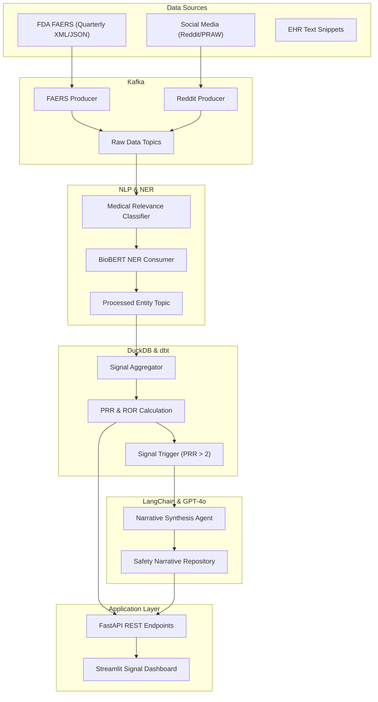

# 🛡️ SentinelRx
### Autonomous Pharmacovigilance Agent for Adverse Event Signal Detection

SentinelRx is a state-of-the-art autonomous AI agent designed to revolutionize drug safety. By ingesting massive streams of post-market data—from structured FDA FAERS reports to unstructured social media discussions—it identifies novel adverse event (AE) signals, performs statistical validation, and synthesizes clinical-grade safety narratives.

---

## 🏗️ System Architecture

SentinelRx is built as a distributed data pipeline, combining streaming engineering with biomedical NLP and LLM reasoning.



---

## 🛠️ Tech Stack

### **Data Engineering**
- **Apache Kafka**: Streaming ingestion of high-volume safety reports.
- **DuckDB**: Embedded analytical database for real-time disproportionality analysis.
- **dbt**: Transforming raw entity extractions into structured signal reports.

### **Natural Language Processing**
- **BioBERT**: Domain-specific BERT model for Biomedical Named Entity Recognition (NER).
- **HuggingFace Transformers**: Deployment of AE/Drug extraction pipelines.

### **Artificial Intelligence**
- **GPT-4o**: Large Language Model for clinical reasoning and narrative synthesis.
- **LangChain**: Orchestration of the narrative agent's workflows.

### **Backend & Visualization**
- **FastAPI**: High-performance REST API for signal discovery.
- **Streamlit**: Interactive dashboard for pharmacovigilance specialists.

---

## 🌟 The Novelty: Why SentinelRx?

Traditional pharmacovigilance is often slow, manual, and reactive. SentinelRx introduces three key innovations:

1.  **Multi-Source Fusion**: It bridges the gap between official regulatory data (FAERS) and the "Patient Voice" on social media, identifying signals that may not yet have reached clinical reports.
2.  **Autonomous Disproportionality**: Instead of static reports, it uses rolling-window statistical analysis (PRR/ROR) to flag signals the moment they cross significance thresholds.
3.  **LLM-Driven Narratives**: It transforms raw coefficients into human-readable, context-aware safety summaries, significantly reducing the cognitive load on safety officers.

---

## 🎯 PRD Objectives

- [x] **Autonomous Ingestion**: Automated pipelines for FDA and Social Media data.
- [x] **Biomedical NER**: Extraction of Drug, Event, and Severity using BioBERT.
- [x] **Signal Validation**: Implementation of PRR (Proportional Reporting Ratio) & ROR (Reporting Odds Ratio).
- [x] **Structured Narratives**: GPT-4o powered synthesis of safety signals.
- [x] **Developer Tools**: Exposed via REST API and ready for Docker deployment.

---

## 🚀 Getting Started

### 1. Prerequisites
- Docker & Docker Compose
- Python 3.9+
- OpenAI API Key
- Reddit API Credentials

### 2. Installation
```bash
git clone https://github.com/your-username/sentinelrx.git
cd sentinelrx
pip install -r requirements.txt
cp .env.example .env # Update with your keys
```

### 3. Execution
1.  **Start Infrastructure**:
    ```bash
    docker-compose up -d
    ```
2.  **Run Pipeline Components**:
    - Ingest FAERS Data: `python src/ingestion/faers_producer.py`
    - Start NER Processing: `python src/nlp/ner_consumer.py`
    - Start Signal Analytics: `python src/analytics/signal_aggregator.py`
3.  **Launch Interface**:
    - API: `python src/api/main.py`
    - Dashboard: `streamlit run src/dashboard/app.py`

---

## ⚠️ Disclaimer
*SentinelRx is a statistical signal detection tool. It identifies associations in reporting data. These signals represent potential safety concerns and do NOT imply confirmed causal relationships. All outputs should be reviewed by a qualified Pharmacovigilance professional.*
